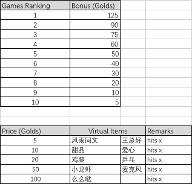

# 王博文APP活跃奖励-2016年11月

个人贡献度= B x 0.6 + E x 0.4

消费积分B = 原积分+ 新消费积分

原积分：来源自消费累计和消费奖励（基数，不再增长）

新消费积分：每支付RMB 1元折合1个积分

经验积分E = 原个人贡献值：金币赚取累计（不含兑换）+ 新经验积分：Exp.

原个人贡献值：金币赚取累计（不含兑换）

新经验积分：Exp.（如下）

粉丝团贡献度= 合计sum（当前团员的个人贡献度）

新经验积分和金币奖励（Golds & Exp.）

| Task | Bonus \(Golds\) | Exp. | Times \(Daily\) | Total Exp. | Total Golds | Remarks |
| :--- | :--- | :--- | :--- | :--- | :--- | :--- |
| Check-in | 2 | 2 | 1 | 2 | 2 |  |
| Comment | 2 | 2 | 6 | 12 | 12 |  |
| Post | 4 | 4 | 2 | 8 | 8 |  |
| Repost | 4 | 4 | 2 | 8 | 8 |  |
| Games | 1 | 1 | 10 | 10 | 10 |  |
| Share Games | 4 | 4 | 1 | 4 | 4 |  |
| Join Groups | 20 | 20 | 1 | 20 | 20 | One time |
| Be Commented | 0 | 2 | 6 | 12 | 0 |  |
| Like | 0 | 1 | 6 | 6 | 0 |  |
| Be Liked | 0 | 1 | 6 | 6 | 0 |  |
| Watch live 15mins+ | 10 | 10 | 1 | 10 | 10 |  |
| Total |  |  |  | 98 | 74 |  |

